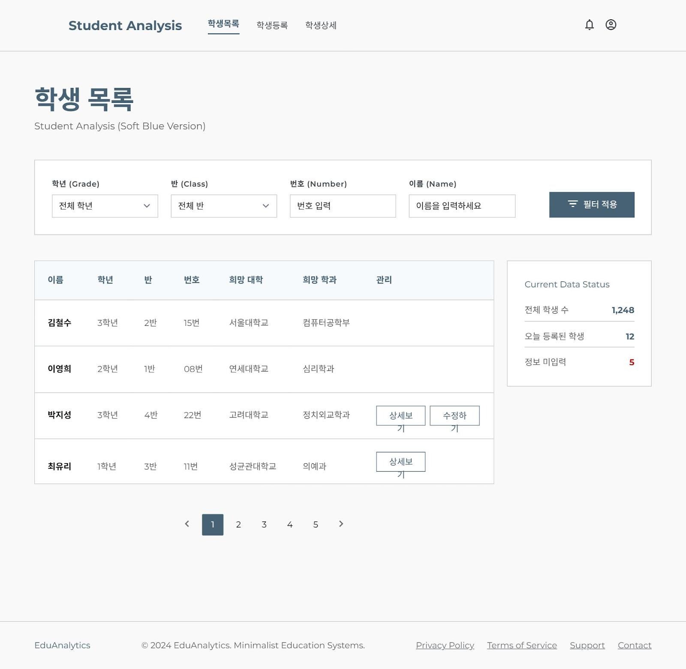
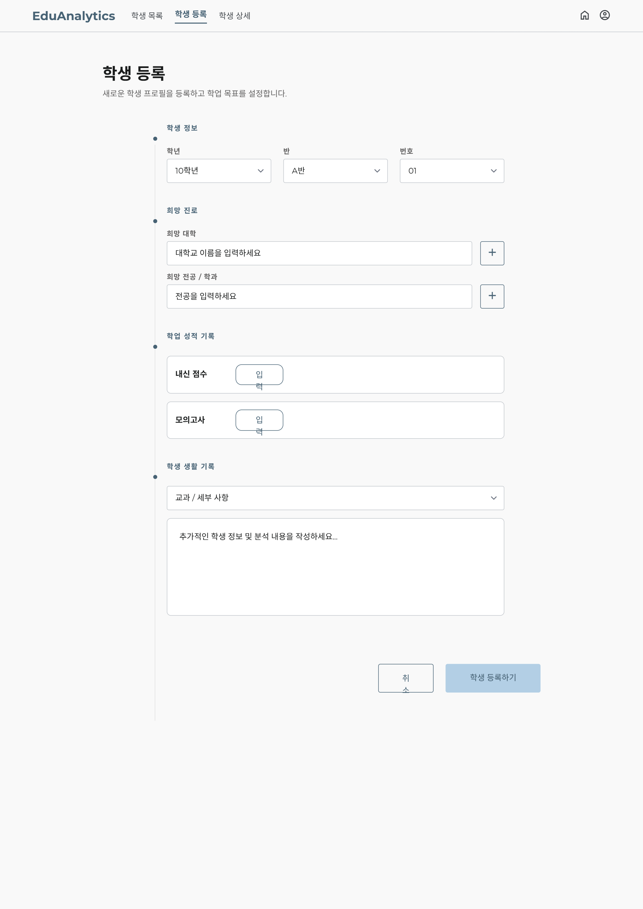
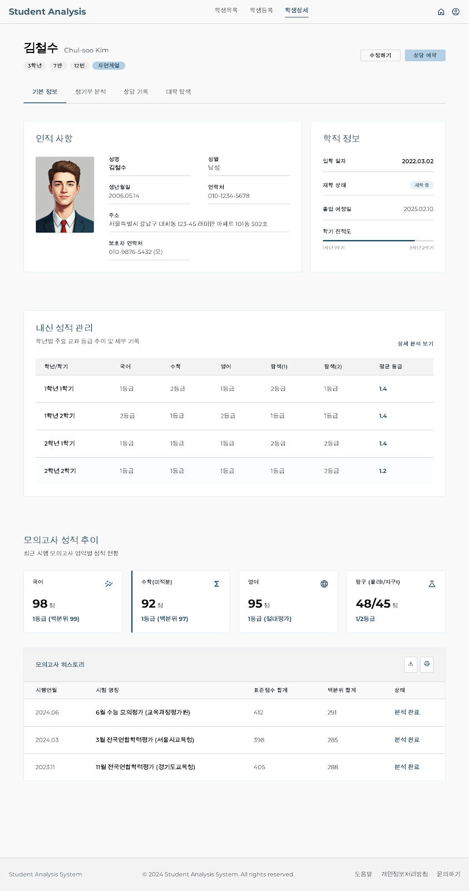
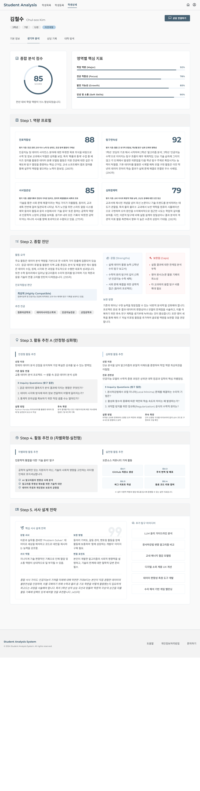
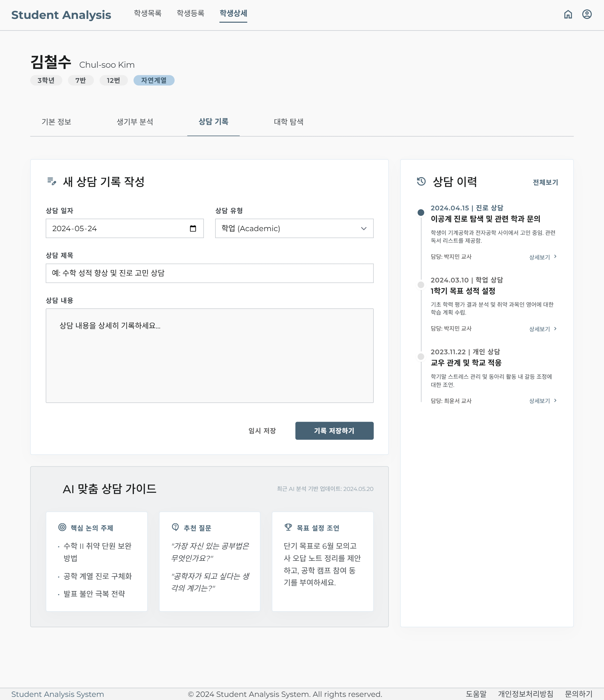
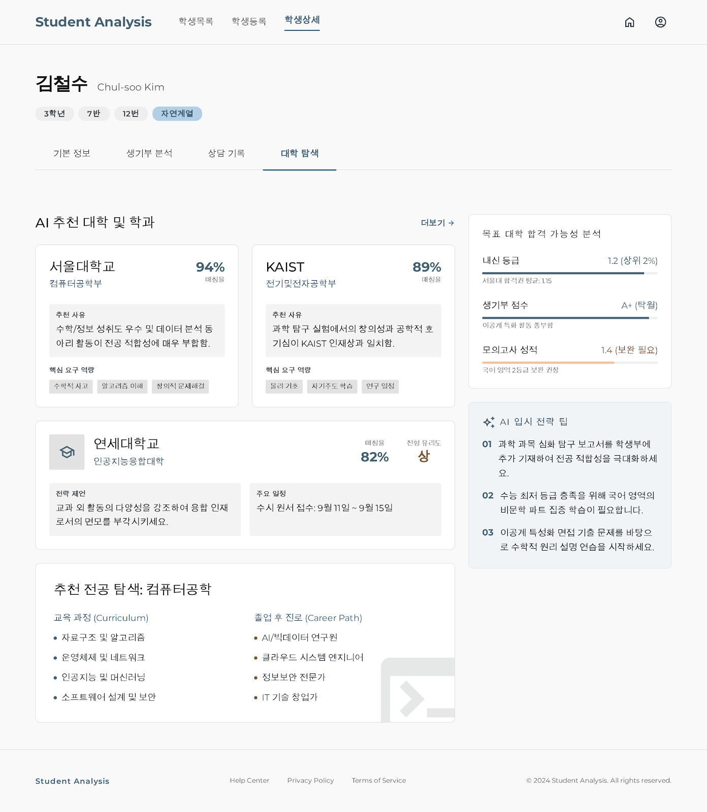

# DESIGN.md

## 테마
**Soft Blue Academy** — Modern Minimalism. 차분하고 신뢰감 있는 교육용 UI.
넓은 여백, 얇은 선, 정밀한 기하학적 구조로 고급스러운 학습 플랫폼 분위기를 표현한다.

---

## 색상

### 핵심 색상
| 토큰 | 값 | 용도 |
|------|----|------|
| `primary` | `#476274` | 버튼, 강조, 링크 |
| `primary-container` | `#b3cfe5` | 버튼 배경, 진행 표시 |
| `on-primary` | `#ffffff` | primary 위 텍스트 |
| `background` / `surface` | `#f9f9f9` | 페이지 배경 |
| `surface-container-lowest` | `#ffffff` | 카드, 패널 배경 |
| `on-surface` | `#1a1c1c` | 본문 텍스트 |
| `on-surface-variant` | `#42474c` | 보조 텍스트 |
| `outline` | `#73787c` | 테두리 |
| `outline-variant` | `#c2c7cc` | 구분선, 약한 테두리 |
| `error` | `#ba1a1a` | 에러 상태 |
| `error-container` | `#ffdad6` | 에러 배경 |

### 전체 팔레트
```
surface-dim: #dadada          surface-bright: #f9f9f9
surface-container-low: #f3f3f3
surface-container: #eeeeee    surface-container-high: #e8e8e8
surface-container-highest: #e2e2e2
inverse-surface: #2f3131      inverse-on-surface: #f1f1f1
secondary: #5f5e5e            secondary-container: #e2dfde
tertiary: #795838             tertiary-container: #efc39c
```

---

## 타이포그래피

폰트: **Montserrat** (영문) + **Noto Sans KR** (한글 fallback)

```css
font-family: 'Montserrat', 'Noto Sans KR', sans-serif;
```

| 스타일 | 크기 | 굵기 | 줄간격 |
|--------|------|------|--------|
| display-lg | 48px | 700 | 1.1 |
| headline-lg | 32px | 600 | 1.2 |
| headline-lg-mobile | 24px | 600 | 1.2 |
| headline-md | 24px | 500 | 1.3 |
| body-lg | 18px | 400 | 1.6 |
| body-md | 16px | 400 | 1.6 |
| label-md | 14px | 600 | 1.0 (letter-spacing: 0.05em) |
| caption | 12px | 400 | 1.4 |

---

## 간격 & 레이아웃

- **기본 단위**: 8px (모든 padding/margin은 8의 배수)
- **Gutter**: 24px
- **최대 너비**: 1280px
- **섹션 간 여백**: 64px 이상 (넓은 여백 강조)

| 브레이크포인트 | 범위 | 컬럼 | 여백 |
|----------------|------|------|------|
| Mobile | < 600px | 4 | 20px |
| Tablet | 600–1024px | 8 | 40px |
| Desktop | > 1024px | 12 | 64px |

---

## 모양 (Border Radius)

| 토큰 | 값 | 용도 |
|------|----|------|
| sm | 2px | 작은 요소 |
| DEFAULT | 4px | 버튼, 인풋 |
| md | 6px | — |
| lg | 8px | 카드, 큰 블록 |
| xl | 12px | — |
| full | 9999px | 뱃지, 칩 |

---

## 컴포넌트 규칙

### 버튼
- Primary: `primary-container(#b3cfe5)` 배경 + `on-surface` 텍스트
- Secondary: 1px `primary` 테두리 + 투명 배경
- 패딩: 수직 16px / 수평 32px

### 인풋
- 기본: 1px 하단 테두리만
- 포커스: 전체 얇은 테두리로 전환
- 레이블: 항상 표시 (label-md 스타일)

### 카드
- 배경: `#ffffff`
- 테두리: 1px `#c2c7cc`
- border-radius: 8px (rounded-lg)
- 내부 패딩: 32px

### 구분선 & 목록
- 1px 수평선으로 항목 구분
- 항목 간 수직 패딩: 24px
- 불릿 없음 — 타이포그래피 굵기로 위계 표현

### 그림자
- 원칙적으로 사용 안 함. 필요 시 ambient shadow만 허용:
  blur 20–30px, opacity 2–3%

### 진행 표시
- 높이 4px, track: `primary-container`, filler: `primary`

---

## UI 스크린샷

### 학생 목록


### 학생 등록


### 학생 상세 — 기본 정보


### 학생 상세 — 생기부 분석


### 학생 상세 — 상담 기록


### 학생 상세 — 대학 탐색

